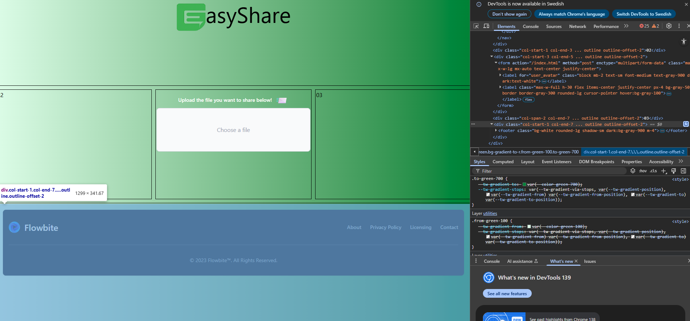
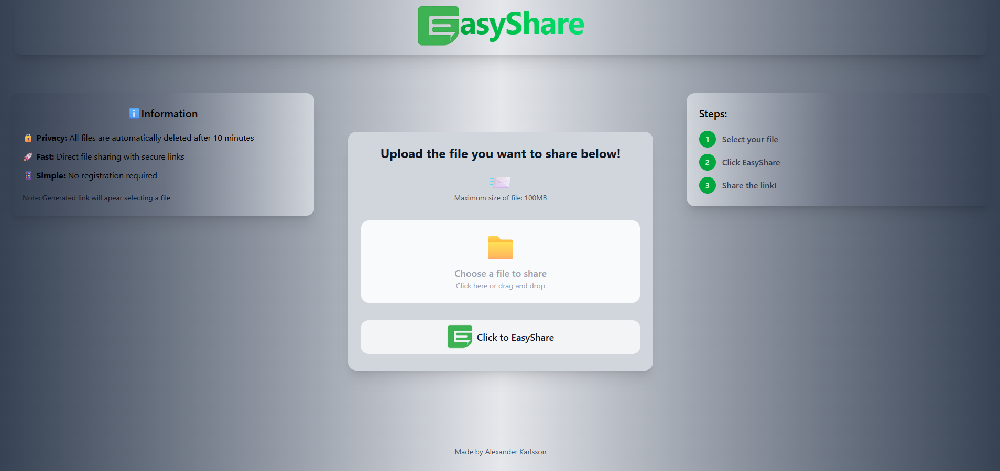
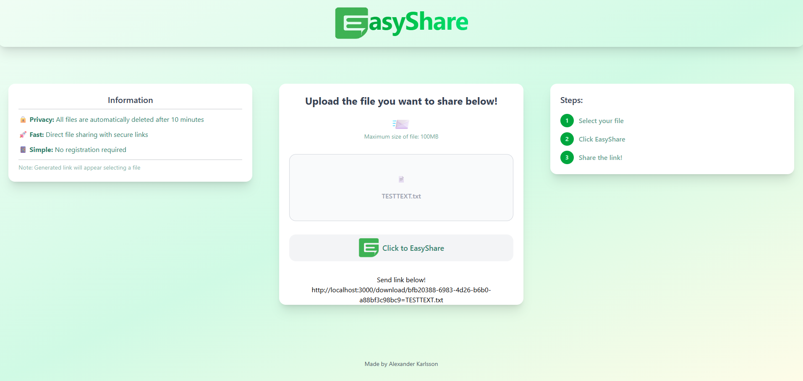
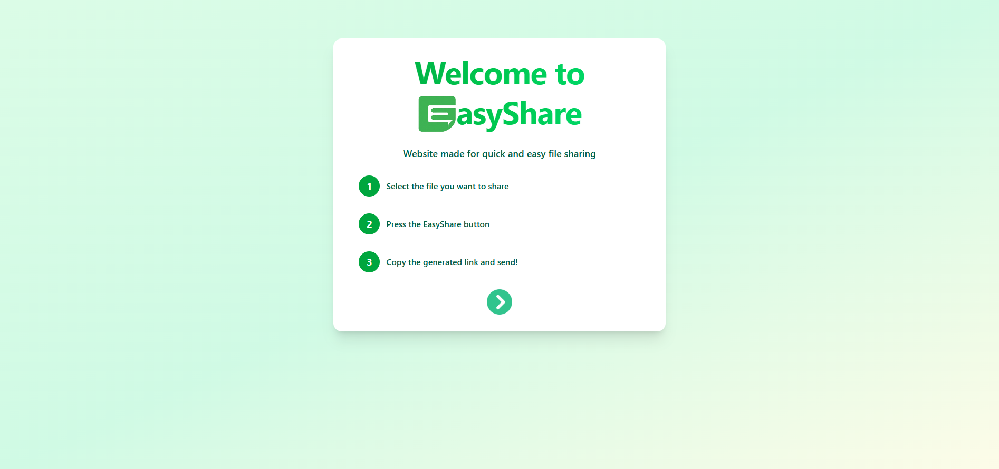
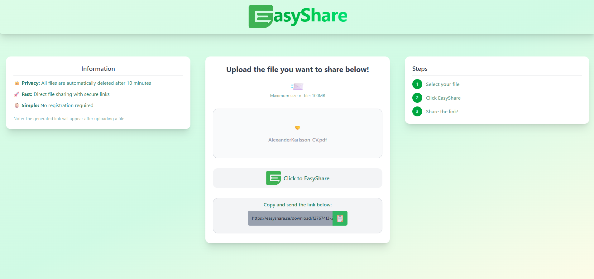

# Workflow from idea to finished product

EasyShare - Share files between friends quick and easy

The birth of the idea: When I was in university we sometimes worked in group projects. One recurring problem was to quickly and easily share files between each other, specifically 20MB+ sized files. 
I had bought an Rasperry Pi 5, and did not know what to really use it for...
So why not use the Pi to host a server and to build a relatively simple website to share files on. The upside of doing it this way is for me to learn along the way how to set up a server on a Pi, full controll of the server and management. 

To actually learn as much as possible I've tryed to limit the use of GenAI as much as possible.
Rules for usage:
  - Never copy code from the GenAI
  - First try to search for solutions on eg. Stackoverflow.
  - Have general informative discussions without code examples.

Tools/Frameworks etc:
- NodeJS, Express, Multer
- React/Vite, Tailwind, prettier
- Cloudflare Tunnel
- Python, CRON

# The development plan (Implemented some improvements from Claude)

Phase 1: Basic Backend 
- Goal: Get file upload and download working
- Set up Express server
- Implement file upload endpoint
- Create temporary file storage on disk
- Build download endpoint with unique ID
- Test with tools like Postman/Thunder Client

Phase 2: Basic Frontend 
- Goal: Simple interface for testing functionality
- Create upload form
- Show generated link after upload
- Create download page that accepts link/ID
- Basic CSS/styling

Phase 3: Link Management & Security
- Goal: Secure, unique links
- Generate cryptographically secure IDs
- Implement link validation
- Add basic security headers
- File size and file type validation

- Used: Helmet, express-rate-limit on client side
- Should implement: ClamAV or cloud API checker for anti-virus

Phase 4: Automatic Deletion
- Goal: Files disappear after 10 min or upon download
- Timer-based deletion
- Deletion on download
- Regular cleanup job
- Database/file to track file status

Phase 5: User Experience
- Goal: Make it user-friendly
- Progress bars for upload/download
- Error handling and user messages
- Responsive design for mobile
- Loading states and feedback

Phase 6: Performance & Robustness
- Goal: Handle large files and multiple users
- Streaming for large files
- Rate limiting
- Proper error handling
- Memory management
- Cleanup code, project structure https://github.com/alan2207/bulletproof-react/blob/master/docs/project-structure.md

Phase 7: Production & Deployment
- Goal: Go live on Raspberry Pi
- Domain setup and DNS
- SSL certificate
- Nginx reverse proxy
- Process management (PM2)
- Monitoring and logs

# How it went

# Phase 1:
Was pretty straight forward. Setting up a simple express server with a couple of GET/POST endpoints. 
Implemented React, Vite dev tool, TailwindCSS framework and Multer. 
Choices:
I basically choose React/Vite/Tailwind because I wanted to explore and learn the industry standard frameworks and libraries, and how to make development faster.
Decided to use Multer library for it's simplicity, being able to store on disk.
I used Postman a bit in the beginning for calls to the API.
Unique ID I choose to go with UUIDV4 because it's easy to setup and implement + making it slim to zero chance of duplicates, although probably not necessary because the files are only on the disk for a very short time.

# Phase 2:
Spent a bit to much time on this step, since it was only supposed to be a simple "frame" with some functionallity. As seen in First draft below, that would probably been enough, but I continued and ended up with Second Draft. Which is a bit to much UI for this phase.

# Phase 3:
As from phase one I've already established to use uuidv4 to create secure unique links. So each file that is uploaded concists of (uuidv4 ID) + (name of file) + (filesize).
Used Helmet middleware to create basic security headers, since I feel it's "good enough" for this application.
I made a file checker function which checks so the file doesn't exceed 100MB, and file type validation. I only have size checker on the clientside, would probably be good to have it on the server aswell.
A concern I had was to probably check the files for malware before uploading them to the RaspberryPi, although they will never be opened on the disk. The two most promenent solutions is to use either ClamAV, a open-source malwvare program or a cloud API checker. Neither is implemented yet.

# Phase 4:
I created an easy Python script for the deletion of files when exeeded the 10 minute mark. I choose this approach because I wanted to keep it simple and reliable, and to keep this logic seperated from the server. I also added a CRON job so the script is running every minute.

Deletion on download was implemeneted by simply use unlinkSync() after the download response to the client and the file is deleted.

# Phase 5:
This phase was focused on the usability and mobile responsivness aspect of the website. From the Second draft I improved the UI with more soothing colors and icons, and eventually ended up with the fifth and final draft which i was happy with.

After some user tests I noticed that there was a lack of usability. When the user clicked on the upload button I had not implemented a loading indicator which incited confusion. The copy to clipboard button was not responsive enough and the users did not fully know if the link was copied or not. So I fixed those issues by implementing a simple loading indicator and responsivness to the copy button. I implemented a error HTML file to respond if the download link is not valid, with a couple of reasons to why that might be. I also on the suggestion from a user, implemented the Fourth draft which is a quick and easy guide for the user on how to use the website by just following three simple steps. 

# Phase 6:
I used express-rate-limit to manage requests from clients and set a timeout if the requests are to many. I implemented error handling in the form component if the file type is prohibited, and error messaging if the file does not exist. 50+ MB files take some time to upload, and I've not yet established how to make it faster, which for this project is not a priority. 

# Phase 7:
My focus on this step was to make it as secure as possible since I'm the one hosting the server. The plan was to use Nginx reverse proxy but after some research I found Cloudflare Tunnel which offered a very easy way to set up a secure connection and eliminating the need to port forward my home network. It's also well established for the  Raspberry Pi and with a integrated SSL Certificate, so I chose to start with using this. 

# UI Iteration
First draft

Second draft

Third

Fourth (After test on users, I've added a info startpage for better UX)

Fifth draft (Final)

